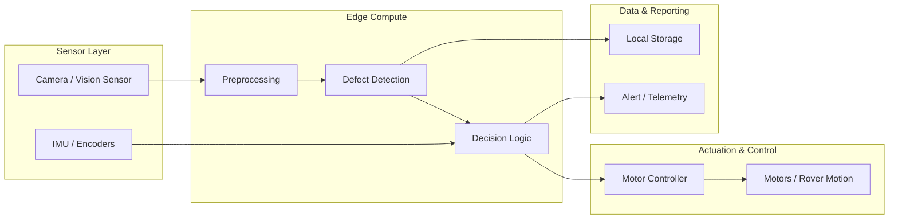
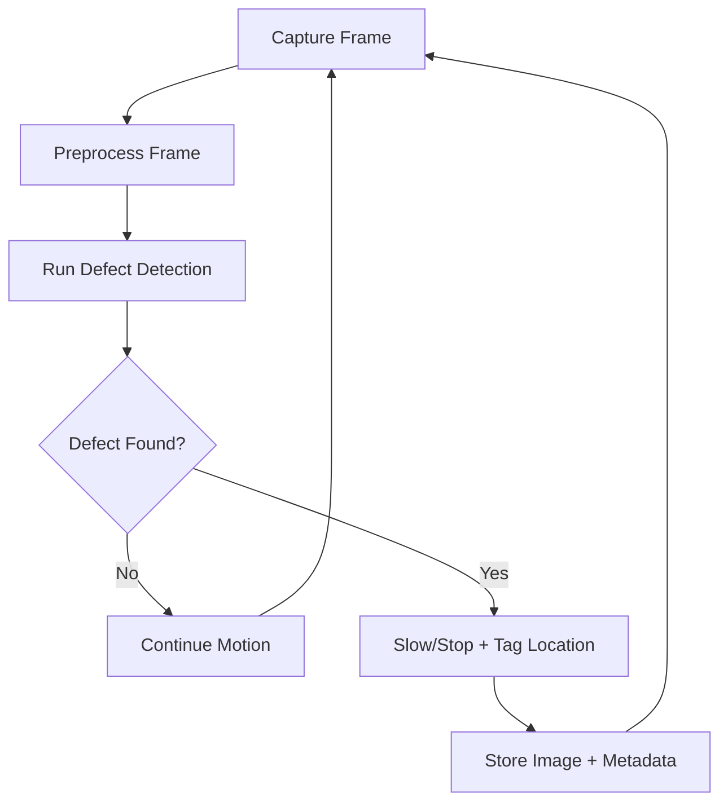
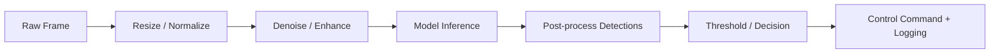
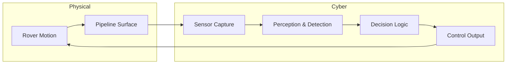

# Pipeline Defect Detection Rover — System Explanation

**Date:** February 11, 2026

## 1. Overview
The Pipeline Defect Detection Rover is a cyber-physical system (CPS) that integrates onboard sensing, edge compute, defect detection algorithms, and control logic to inspect pipeline surfaces. It captures visual data, processes it in real time to detect defects, and closes the loop by adjusting rover motion and reporting findings. The system is structured around three primary subsystems:

- **Perception**: Camera and image acquisition
- **Intelligence**: Defect detection and decision logic
- **Actuation & Control**: Rover motion and feedback

## 2. Functional Components

### 2.1 Sensor Layer
- **Camera module** captures continuous frames of the pipeline surface.
- **Optional sensors** (e.g., IMU, encoders) provide motion state and orientation (if available).

### 2.2 Edge Compute Layer
- Preprocessing of frames (resize, denoise, color normalization).
- Inference using defect detection algorithms.
- Aggregation of detection results (defect class, confidence, location).

### 2.3 Control & Actuation
- Control logic uses detection output to decide motion states:
  - **Continue** if no defect is detected.
  - **Slow / Stop** if defect confidence exceeds threshold.
  - **Mark location** for logging or operator review.
- Motor control executes the desired motion command.

### 2.4 Data & Reporting
- Logs of defect images and metadata are stored locally.
- Optional transmission of alerts to a base station.

## 3. System Architecture (Mermaid)

## 4. Data Flow Diagram (Mermaid)

## 5. Processing Pipeline (Mermaid)

## 6. Cyber-Physical Feedback Loop (Mermaid)

## 7. Detailed System Behavior

### 7.1 Normal Inspection
1. Rover moves at nominal speed.
2. Camera streams frames continuously.
3. Detection model scans for anomalies (cracks, corrosion, dents).
4. If no defect is found, rover continues.

### 7.2 Defect Encounter
1. Detection model marks a defect above threshold.
2. Decision logic issues slow/stop command.
3. System logs:
   - Image frame
   - Timestamp
   - Location estimate
   - Confidence score
4. Optional alert to operator.

### 7.3 Safety & Robustness
- If frames drop or confidence is low, the rover can reduce speed.
- If sensor input is invalid, the system fails safely (stop).

## 8. Key Parameters (Typical)
- **Frame rate**: 15–30 FPS
- **Confidence threshold**: 0.6–0.8
- **Control response time**: < 200 ms
- **Storage**: ring buffer + persistent log on defect

## 9. Extensibility
- Swap detection model without changing the control interface.
- Add depth or thermal sensors for multi-modal inspection.
- Integrate GPS/SLAM for precise defect localization.

---

If you want this aligned to the exact project files or want the diagram labels changed to match code modules, say the word and I will update it.